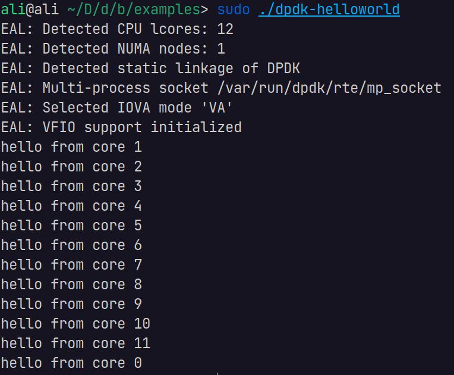
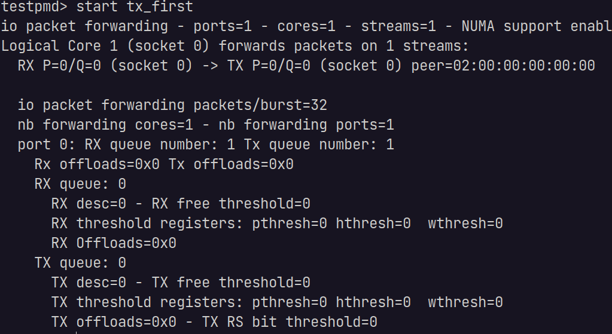
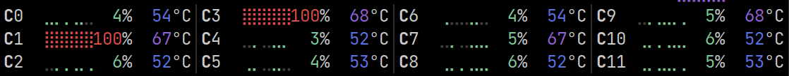
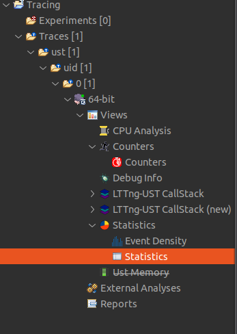
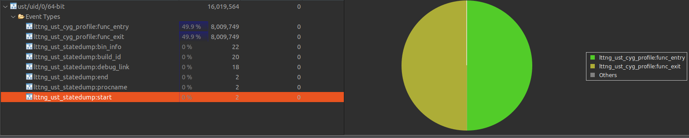

## OS Trace Course DPDK Labs
In This report we are going to have a look at user space function tracing and performance analysis on DPDK, using LTTng.

### Installing and building DPDK from source with support for function tracing
- First we are going to download latest version of DPDK from https://core.dpdk.org/download/
- Extract the downloaded archive
  ```shell
  tar xJf dpdk-<version>.tar.xz
  cd dpdk-<version>
  ```
- Setup meson
  ```
  meson setup build \
  -Dexamples=all \
  -Dlibdir=lib \
  -Denable_trace_fp=true \
  -Dc_args="-finstrument-functions"

  ```
- Build using ninja
  ```
  cd build
  ninja
  meson install
  ldconfig
  ```
  *The last two commands must be run as root.*
  
  Now the built binaries are available at the `/build/app` folder.

  ## Configuring huge pages and vfio virtual driver
  ```
  echo 1024 > /sys/kernel/mm/hugepages/hugepages-2048kB/nr_hugepages
  mkdir /mnt/huge
  mount -t hugetlbfs pagesize=1GB /mnt/huge
  modprobe vfio-pci
  dpdk-devbind.py --bind=vfio-pci 0000:08:00.0
  ```
  *Note: In the DPDK guides it is mentioned that you need a detach a NIC from your kernel and dedicate it to the DPDK, you might not need it for the testpmd but it is required for other apps. The mentioned vfio-pci ID is my ethernet card, usually your system should have two NICs, for wifi and ethernet, use the one that suits you. You can get the list of your NIC IDs from the `dpdk-devbind.py --status` command. You need to run this script every time you restart your system.

  ### Test the installation
  - Go to the `/build/examples` folder and run the helloworld app with:
   
    ```
    sudo ./dpdk-helloworld
    ```
    You should see an out put like this:
    
    This indicates that the DPDK is installed and working properly.

   ### Prepare your system for user space function tracing
   You need to install LTTng, is is available in the Ubuntu apt repository so we are not going the tend to that. But note that you need to have `lttng-modules-dkms lttng-tools liblttng-ust-dev` packages minimum.

   ### Setup DPDK testpmd client and server.

   Before we start the process make sure that the shared library at `/usr/lib/x86_64-linux-gnu/liblttng-ust-cyg-profile.so` is available. Note that the location or name of this file might defer depending on your system and cpu architecture.
  
  - First we are going to our DPDK build folder. Run the client with this command. Note that each client and server must be run on a dedicated terminal windows, either use a new tab or window or use TMUX.
    ```
    sudo LD_PRELOAD=/usr/lib/x86_64-linux-gnu/liblttng-ust-cyg-profile.so ./app/dpdk-testpmd -l 0-1 --proc-type=primary  --file-prefix=pmd1 --vdev=net_memif,role=server -- -i
    ```
    This runs the server. Leave this window open.
    In a new terminal window run this command to start the client.
    ```
    sudo LD_PRELOAD=/usr/lib/x86_64-linux-gnu/liblttng-ust-cyg-profile.so ./app/dpdk-testpmd -l 2-3 --proc-type=primary --file-prefix=pmd2 --vdev=net_memif -- -i
    ```
    Now you should have two terminal windows open. In the client window run the `start` and in the server run the `start tx_first` to initiate the packet forwarding process.

    Here is what the terminal should look like:

    

    *Note that at this point two of your CPU cores must be running at 100%. You can use tools like `btop` or `top` to confirm this.

    

    ### Prepare LTTng for tracing.
    We are going to make a shell script that sets up the LTTng session and adds the required contexts, starts the session, sleep for amount of time and stops and destroys the session. Note that the 1 second of tracing generates about a 800MB of data.

    ```
    lttng create testpmd-memif-lttng --output /home/ali/Desktop
    lttng enable-channel --userspace --num-subbuf=4 --subbuf-size=32M channel0
    lttng enable-event --channel channel0 --userspace --all
    lttng add-context --channel channel0 --userspace --type=vpid --type=vtid --type=procname --type=perf:thread:cpu-cycles --type=perf:thread:instructions --type=perf:thread:cache-misses --type=perf:thread:page-fault --type=perf:thread:dTLB-load-misses --type=perf:thread:L1-dcache-load-misses  --type=perf:thread:LLC-load-misses
    lttng start
    sleep 1
    lttng stop
    lttng destroy
    ```
    *Note that you need to adjust your subbuf size according to your memory size, also adjust the output folder based on your needs.

    ### Break down your trace contexts into sub traces
    Incase you have negative counter values in your trace file, you should split your contexts into smaller chunks. For example trace the cache load misses alone in their own trace file and compare the results of other chunks traces with each other. For example if you find out that in the tx_burst a lot of cache miss happens, you can go to the other trace files and check if other context behave the same?

    ### Import your trace files to TraceCompass
    Download and run the TraceCompass from this link:
    https://eclipse.dev/tracecompass/
    From the `file -> import` select your root directory.
    If you did not pass the output option to the LTTng script, the output defaults to the root directory.
    Open the trace from the left menu: 

    

    In the statistics tab you should not see any misses, if you see misses, you should alter your subbuf size:
    
    